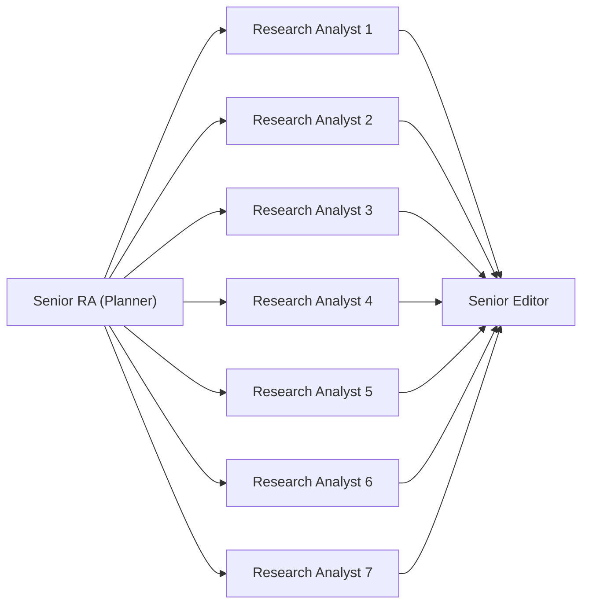
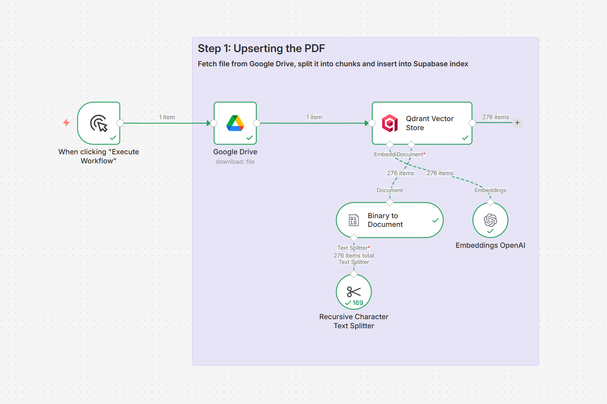
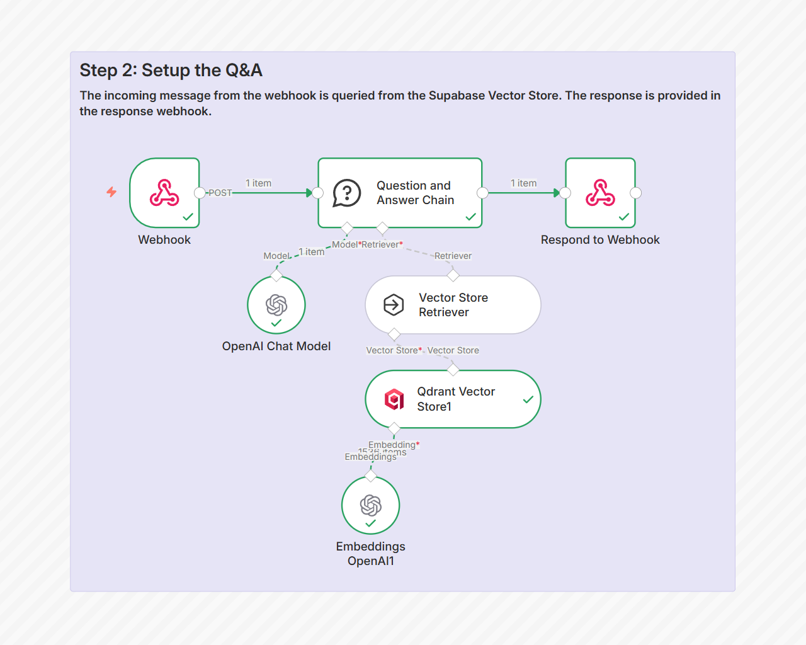
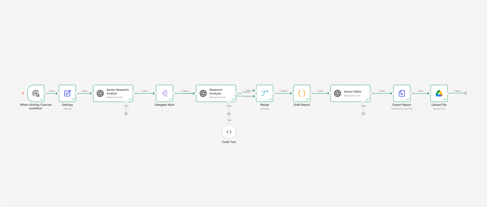

## 🤖💹 Agent Planning & Decomposition Pattern — Multi‑Agent Equity Research Pipeline

## 📌 Project Overview
This project demonstrates a **multi‑agent equity research pipeline** built with [n8n](https://n8n.io).  
It automates the production of investor‑ready equity research reports from SEC 10‑K filings, combining analyst role prompts, drafting, editorial refinement, and final export.  

The system consists of:
- **Main Workflow**: `Multi‑AgentEquityResearchPipeline` — orchestrates report generation.  
- **Supporting Workflow**: `UpsertQ&A` — ingests SEC filings into a vector store and enables retrieval‑augmented Q&A.  

Usage begins with **UpsertQ&A** to prepare the document knowledge base, followed by **Multi‑AgentEquityResearchPipeline** to generate the full report.

---

## 🧩 Pattern Insight
This workflow exemplifies the **Agent Planning & Decomposition pattern**:  
- A **Senior Research Analyst** acts as planner, decomposing the report into structured tasks.  
- Multiple **Research Analysts** execute the subtasks in parallel.  
- A **Senior Editor** refines the merged draft into a polished final report.  

This showcases how n8n can orchestrate multi‑role agent collaboration, a pattern with significant industry relevance for complex knowledge work.



---

## 🛠️ Tech Stack
- **n8n** — workflow orchestration  
- **OpenAI GPT‑4.1 family + text-embedding-3-small** — analysis, drafting, editing + embeddings
- **Qdrant** — vector store for SEC filings  
- **Google Drive** — document source and final report storage  
- **JavaScript** — custom code nodes for tool integration and assembling draft report

---

## 📁 Repository Structure

```
screenshots/                              # Screenshot images used in README.md
Multi‑AgentEquityResearchPipeline.json    # Main n8n workflow for equity research pipeline
README.md                                 # Project documentation
UpsertQ&A.json                            # Supporting n8n workflow for SEC 10-K ingestion and Q&A
code-tool.js                              # JavaScript code for SEC 10-K query tool (RAG via webhook)
draft-report.js                           # JavaScript code assembling draft report
nvidia-report.md                          # Example final equity research report
nvidia.pdf                                # NVIDIA Annual Report (SEC Form 10-K)
prompt - Code Tool.txt                    # Prompt definition for Code Tool
prompt - Research Analyst.txt             # Prompt definition for Research Analyst role
prompt - Senior Editor.txt                # Prompt definition for Senior Editor role
prompt - Senior Research Analyst.txt      # Prompt definition for Senior Research Analyst role
```

---

## 🏗️ Architecture

1. **UpsertQ&A Workflow**  
   - Downloads SEC 10‑K PDF (e.g. `nvidia.pdf`) from Google Drive  
   - Splits into chunks, generates embeddings, and upserts into Qdrant  
   - Provides retrieval‑augmented Q&A via webhook  

<div align="center">
  
  <p><em>Annual Report Upsert Workflow</em></p>
</div>

<div align="center">
  
  <p><em>Annual Report RAG Workflow</em></p>
</div>

2. **Multi‑AgentEquityResearchPipeline Workflow**  
   - **Settings**: define company ticker, word count, SEC 10‑K webhook URL  
   - **Senior Research Analyst**: produces blueprint (title, subtitle, intro, conclusions, section prompts)  
   - **Delegate Work**: splits prompts into tasks  
   - **Research Analysts**: generate each section based on SEC 10‑K data  
   - **Code Tool (Tool Prompt + JavaScript)**: queries SEC 10-K for RAG Q&A via webhook
   - **Merge**: combines outputs by position  
   - **Draft Report (JavaScript)**: assembles intro, sections, conclusions into a draft  
   - **Senior Editor**: refines draft into polished investor‑ready report  
   - **Export Report**: converts text into Markdown file  
   - **Upload File**: stores final report in Google Drive  

<div align="center">
  
  <p><em>Equity Research Pipeline Architecture</em></p>
</div>

---

## ⚙️ Setup Instructions
1. Clone this repo and import both workflows (`Multi‑AgentEquityResearchPipeline.json`, `UpsertQ&A.json`) into n8n.  
2. Configure credentials:  
   - Google Drive access  
   - Qdrant connection  
   - OpenAI API key  
3. Upload SEC 10‑K PDF (e.g., `nvidia.pdf`) to Google Drive.  
4. Run **UpsertQ&A** to ingest the document into Qdrant.  
5. Copy `Production URL` from **Webhook** of **UpsertQ&A**, paste to `webhook_url_sec10k_data` in **Settings** of **Multi‑AgentEquityResearchPipeline**.
6. Publish **UpsertQ&A**.
7. Execute **Multi‑AgentEquityResearchPipeline** to generate the equity research report.  

---

## 🚀 Usage
- **Step 1**: Run `UpsertQ&A` to prepare the SEC 10‑K knowledge base.  
- **Step 2**: Run `Multi‑AgentEquityResearchPipeline` to generate the report.  
- Output: Markdown file (e.g., `nvidia-report.md`) uploaded to Google Drive.  

Example output:  
- `nvidia-report.md` — a structured, polished equity research report ready for investors.  

---

## 🔮 Future Work
- Add PDF export for investor distribution.  
- Extend pipeline to support multiple companies in parallel.  
- Enhance Q&A workflow for interactive analyst queries.  
- Deploy the workflows to cloud (e.g. Railway.com).
- Integrate CI/CD for automated workflow updates.
- Integrate monitoring/logging for production reliability.  

---

## 📑 Appendix

### Research Team Prompts
- **Senior Research Analyst** — defines report blueprint (title, subtitle, intro, conclusions, section prompts).  

  ```text
  You work as a Senior Research Analyst at Goldman Sachs, focusing on fundamental research for tech companies. You have a team of Research Analysts that will help you with various aspects of fundamental stock research.

  Your task is to break down the work of this analysis report, to write:
  - The title
  - The subtitle
  - The section details
  - The introduction
  - The conclusions
  - An image prompt for a SEO-friendly article about the company {{ $json.company }}

  This analysis report will be a comprehensive analysis of {{ $json.company }} using the latest SEC 10-K filing.  
  You must not miss any of the following 7 key sections. Each section is mandatory and must be included in the output:  
  - Business Overview  
  - Company Strategy  
  - SWOT (Strength, Weakness, Opportunities, Threats)  
  - Top 3 Risk Factors  
  - Management's Discussion and Analysis (MD&A)  
  - Near-term Catalysts for Growth  
  - Future Outlook  

  Detailed Instructions:
  - The analysis should be unbiased and factual
  - Place the article title in a JSON field called `title`
  - Place the subtitle in a JSON field called `subtitle`
  - Place the introduction in a JSON field called `introduction`
  - In the introduction, introduce the topic that is then explored in depth in the rest of the text
  - The introduction should be around 60 words
  - Place the conclusions in a JSON field called `conclusions`
  - The conclusions should be around 60 words
  - Use the conclusions to summarize all said in the article and offer a conclusion to the reader
  - The image prompt will be used to produce a photographic cover image for the article and should depict the topics discussed in the article
  - Place the image prompt in a JSON field called `imagePrompt`
  - For each section provide a title and an exhaustive prompt that your teammates of Research Analysts can follow that will be used to write the section text
  - Place the sections in an array field called `sections`
  - For each section provide the fields `title` and `prompt`
  - The sections should follow a logical flow and not repeat the same concepts
  - The sections should relate to one another and not be isolated blocks of text; the text should be fluent and follow a linear logic
  - Don't start the section with "section 1", "section 2", "section 3"... just write the title of the section
  - For the title and the section titles don't use colons (`:`)
  - For the text, use markdown language for formatting
  - Go deep in the topic you treat, don't just throw some superficial info
  ```

- **Research Analyst** — generates individual sections with coherence across report.  

  ```text
  You are a Research Analyst in the finance industry working with a Senior Research Analyst to produce an insight report.

  Your task is to write a section of the report analyzing {{ $('Settings').item.json.company }}. Here is the context of the report that the Senior Research Analyst created:
  - Overall report title: {{ $('Senior Research Analyst').item.json.output[0].content[0].text.title }}
  - Overall report subtitle: {{ $('Senior Research Analyst').item.json.output[0].content[0].text.subtitle }}

  Use the prompt created by the Senior Research Analyst and write a section titled {{ $json.title }} using this prompt as starting point: {{ $json.prompt }}.

  Guidelines:
  - All information is sourced from {{ $('Settings').item.json.company }} latest SEC 10-K filing and that the analysis is unbiased and factual
  - Return only plain text for each section (no JSON structure)
  - Use markdown for formatting
  - Do not add internal titles or headings
  - The length of each section should be approximately {{ Math.round(($('Settings').item.json.words - 120)/ $('Settings').item.json.sections) }} words
  - Go deep in the topic you treat, avoid just throwing some superficial info
  {{ $itemIndex > 0 ? "- The previous section talks about " + $input.all()[$itemIndex-1].json.title : "" }}
  {{ $itemIndex > 0 ? "- The prompt for the previous section is " + $input.all()[$itemIndex-1].json.prompt : "" }}
  {{ $itemIndex < $input.all().length - 1 ? "- The following section will talk about " + $input.all()[$itemIndex+1].json.title : "" }}
  {{ $itemIndex < $input.all().length - 1 ? "- The prompt for the following section is " + $input.all()[$itemIndex+1].json.prompt : "" }}
  - Ensure coherence of the text with the preceding and following sections
  - This section should not repeat the concepts already exposed in the previous sections
  - This section is a part of a larger report so that it be merged with the rest of the report; do not include an introduction or any conclusions
  ```

- **Senior Editor** — refines draft into polished investor‑ready report.  

  ```text
  You are a detail-oriented Senior Editor known for producing clear, polished, and investor-ready research reports.

  Your task is to paraphrase and refine the draft report produced by the Research team.
  This report is targeted at the investor community, so ensure the writing is professional, coherent, and stylistically consistent.

  Guidelines:
  - Do not remove or omit any important information from the draft
  - Do not add new analysis, new facts, or new interpretations
  - Maintain the original structure and section order
  - Preserve the full level of detail; do not shorten the content
  - Improve clarity, flow, readability, and professional tone
  - Ensure the final output reads like a polished, publication-ready research report

  Here is the draft report:
  {{ $json.article }}
  ```

### Custom Tool & Codes
- **Code Tool**  
  - Tool Prompt: queries SEC 10‑K for fundamental Q&A.  

    ```text
    Use this tool to answer fundamental questions about {{ $('Settings').item.json.company }} from SEC 10-K. The input to this tool should be the question to be asked about {{ $('Settings').item.json.company }}. For example, what does {{ $('Settings').item.json.company }} do to earn money?
    ```

  - JavaScript: integrates webhook call for retrieval.  

    ```js
    options = {
        url: $('Settings').item.json.webhook_url_sec10k_data,
        method: 'POST',
        body: {"input": query, "company": $('Settings').item.json.company}
    }
          
    try {
      const response = await this.helpers.httpRequest(options);
      console.log(response)
      return response
      } catch (error) {
        return "error";
    }
    ```

- **Draft Report**  
  - JavaScript: concatenates intro, sections, and conclusions into a draft article.  

    ```js
    let article = "";

    // Introduction
    article += $("Senior Research Analyst").first().json.output[0].content[0].text
      .introduction;
    article += "\n\n";

    for (const item of $input.all()) {
      article += "**" + item.json.title + "**";
      article += "\n";
      article += item.json.output[0].content[0].text;
      article += "\n\n";
    }

    // Conclusions
    article += "**Conclusions**";
    article += "\n\n";
    article += $("Senior Research Analyst").first().json.output[0].content[0].text
      .conclusions;

    return [
      {
        json: {
          article: article,
        },
      },
    ];
    ```
